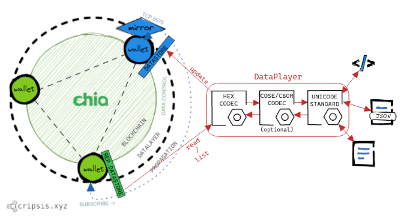

# Chia DataPlayer



## Description
Welcome to Chia DataPlayer. Work with Chia DataLayer in a human way and encrypt any data you want with COSE (CBOR Object Signing and Encryption).
Developed and tested only with the official [chia-blockchain](https://github.com/Chia-Network/chia-blockchain) project.

If you found the project useful, please consider a donation to my chia wallet :) 

 `xch1vt3g694eclvcjmrj8mq83vtgrva9sw0qdz34muxrqjh5y5fzq6vq89n605` | `cripsis.xch`

Presentation page: https://www.cripsis.xyz/chia-dataplayer-trabaja-con-datalayer-como-un-humano/

## Requirements
A python3 interpreter and the pipenv library, to create and use virtual environment. 

```bash
pip3 install pipenv
```

## Usage 
### The environment
* Install the environment with 

```bash
pipenv install
```

* Enter in the environment with 

```bash
pipenv shell
```

You can also execute dataplayer without entering in the environment, using `pipenv run python dataplayer [params]`, example:

```
pipenv run python dataplayer --help

usage: usage: dataplayer datastore [-h] --id ID [--codec {hex,cose}] --action {update_key,read_key,list_keys} [--key KEY] [--value VALUE] [--cose-ph COSE_PH [COSE_PH ...]] [--cose-uh COSE_UH [COSE_UH ...]]
...


```
### Config
* config.yaml is loaded by default. Edit it if you are not using DataPlayer on the same machine as a Chia Node.

## Config file
Example of config file:
```yaml
---
rpc_connector: 
  host: "localhost" #Host of the wallet
  private_wallet_cert_path: "~/.chia/mainnet/config/ssl/wallet/private_wallet.crt" #Private certificate to connect with RPC
  private_wallet_key_path: "~/.chia/mainnet/config/ssl/wallet/private_wallet.key" #Key of the certificate to connect with RP
  service_ports: 
    wallet: 9256 #TCP Port of wallet RPC
    datalayer: 8562 #TCP Port of datalayer RPC
  service_wallets: 
    chia: 1 #ID of Chia wallet (default)
    datalayer: 2 #ID of datalayer wallet (default)

log_level: "WARNING" #Log level (DEBUG, INFO, WARNING, ERROR) (default WARNING)

```

### COSE Encode and Encrypt and Decode and Decrypt
If you want to store or read your encrypted data, you need to set the correct HMAC KEY editing the `.env` file, and set COSE_KEY with your desired key. Actually, only MAC0 (An authenticated COSE message with one recipient) is supported


## Arguments

```bash
usage: dataplayer datastore [-h] --id ID [--codec {hex,cose}] --action {update_key,read_key,list_keys} [--key KEY] [--value VALUE]
                            [--cose-ph COSE_PH [COSE_PH ...]] [--cose-uh COSE_UH [COSE_UH ...]]

optional arguments:
  -h, --help            show this help message and exit
  --id ID, -i ID        Datastore ID
  --codec {hex,cose}, -c {hex,cose}
                        Encoding type for reading or updating (default hex)
  --action {update_key,read_key,list_keys}, -a {update_key,read_key,list_keys}
                        Action to execute over datastore (required)
  --key KEY, -k KEY     Key of selection (required for read_key, update_key actions)
  --value VALUE, -v VALUE
                        Value for update_key action (optional)
  --value-from-file VALUE_FROM_FILE, -vff VALUE_FROM_FILE
                        Read a file from path for update_key action if specified (optional)
  --value-to-file VALUE_TO_FILE, -vtf VALUE_TO_FILE
                        Write value to a file path for read_key action if specified specified (optional)
  --cose-ph COSE_PH [COSE_PH ...], -cph COSE_PH [COSE_PH ...]
                        List of protected headers to store for update_key action and cose codec (optional). Format: FOO=BAR ABC=XYZ
  --cose-uh COSE_UH [COSE_UH ...], -cuh COSE_UH [COSE_UH ...]
                        List of unprotected headers to store for update_key action and cose codec (optional). Format: FOO=BAR ABC=XYZ
```

## Examples

### List Keys

```
./dataplayer datastore --id="2530caa7911d0c7c3b93f53927f0fd5bf18b82ac290f4476e26e5b3c32e8526c" -a "list_keys"
{
  "keys": [
    "key1",
    "humanized_key",
    "other_key",
    "encoded_key"
  ],
  "success": true
}

```

### Update Keys with default HEX encoding

```
./dataplayer datastore --id="2530caa7911d0c7c3b93f53927f0fd5bf18b82ac290f4476e26e5b3c32e8526c" -a "update_key" -k "humanized_key" -v "hello world" -c hex
{
  "success": true,
  "tx_id": "0x1ba3397f6e51a16e03244d4015bfcce6d598053db91c3ace6c036e038a006f5e"
}

```

### Update Keys with COSE encoding and encrypting

```
./dataplayer datastore --id="2530caa7911d0c7c3b93f53927f0fd5bf18b82ac290f4476e26e5b3c32e8526c" -a "update_key" -k "encoded_key" -v "hello worrldd" -c cose -cph a_protected_header=secret_value -cuh an_unprotected_header=public_value
{
  "success": true,
  "tx_id": "0xaecb1953cdbdb5c2294591c0538c6315c5f2fcfe8fcebf1418680b25271943ad"
}

```

#### AND reading value from a file
```
./dataplayer datastore --id="2530caa7911d0c7c3b93f53927f0fd5bf18b82ac290f4476e26e5b3c32e8526c" -a "update_key" -k "file_test_5" -vff /root/chia-dataplayer/BigBuckBunny.mp4 -c cose -cph a_protected_header=secret_value -cuh an_unprotected_header=public_value
{
  "success": true,
  "tx_id": "0x0efede57f3da33c86a0a5e1b823d655db4411d109c74f327079e369791671010"
}
```

### Read Keys with default HEX encoding
```
./dataplayer datastore --id="2530caa7911d0c7c3b93f53927f0fd5bf18b82ac290f4476e26e5b3c32e8526c" -a "read_key" -k "humanized_key" -c hex
{
  "success": true,
  "value": "hello world"
}

```

### Read Keys with COSE encoding and encrypting
```
./dataplayer datastore --id="2530caa7911d0c7c3b93f53927f0fd5bf18b82ac290f4476e26e5b3c32e8526c" -a "read_key" -k "encoded_key" -c cose
{
  "success": true,
  "value": {
    "payload": "hello worrldd",
    "protected_headers": {
      "a_protected_header": "secret_value"
    },
    "unprotected_headers": {
      "an_unprotected_header": "public_value"
    }
  }
}
```
#### AND writing value (payload) to a file 
```
./datastore --id="2530caa7911d0c7c3b93f53927f0fd5bf18b82ac290f4476e26e5b3c32e8526c" -a "read_key" -k "file_test_5" -c cose -vtf /root/chia-dataplayer/rep_BigBuckBunny.mp4
```
